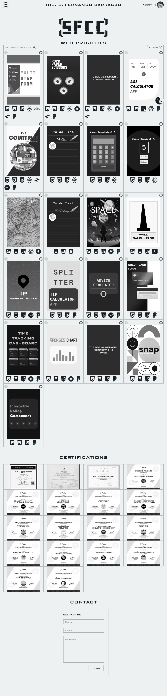

# SFCC Web Projects

## Table of contents

- [Overview](#overview)
  - [The project](#the-project)
  - [Screenshot](#screenshot)
  - [Links](#links)
- [My process](#my-process)
  - [Built with](#built-with)
- [Author](#author)

## Overview

### The project

This project is a web portfolio. It was developed using Html, Css, Sass, JSON, JavaScript, and React.js, with the main objective of showcasing the different projects I have worked on and the technologies used in each of them. It includes direct links to their respective GitHub repositories, an info button and an illustration as cover made with Adobe Illustrator. Additionally, it features a certifications section where I detail the courses and certifications I have obtained throughout my professional career.

The website also includes a contact section for users to reach out to me directly. The "About Me" section describes my professional profile and provides links to my GitHub, Linkedin, Manfred profile and my resume (CV). It also highlights the main technologies I have experience with.

To facilitate searching and navigation between projects, a project search functionality and a filter based on the technologies used in each project have been implemented. Furthermore, a dark mode has been incorporated to enhance the user experience across different environments. In addition to a mobile-first approach and responsive design, the website includes animations that enrich the user experience on various devices and screen sizes.

### Screenshot

### Links

- Solution URL: [GitHub](https://github.com/SFCC5555/sfcc-web-projects)
- Live Site URL: [SFCC Web Projects](https://sfcc5555.netlify.app/)

## My process

### Built with

- Semantic HTML5 markup
- CSS custom properties
- Flexbox
- Mobile-first workflow
- JavaScript
- JSON
- Sass
- [React](https://reactjs.org/) - JS library

## Author

- Website - [Fernando Carrasco Portfolio](https://sfcc5555.netlify.app/)
