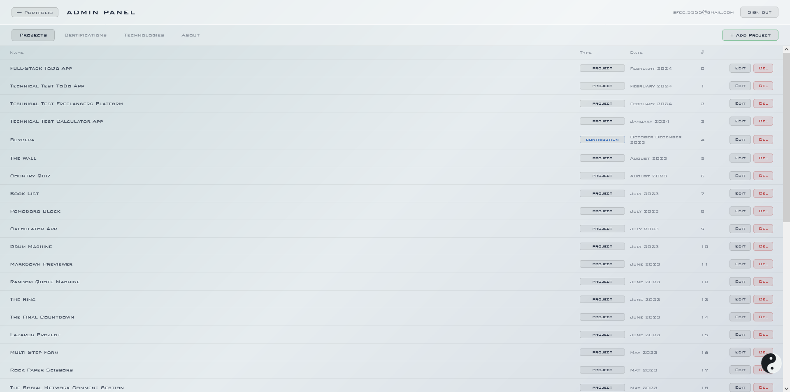

# Fernando Carrasco Portfolio

A modern full-stack portfolio built to showcase my professional experience, projects, certifications, and technical skills.

The application evolved from a static React portfolio into a production-ready application with a modern UI, Supabase backend, authentication, and a complete admin dashboard for content management.

## Live Demo

🌐 https://fernando-carrasco.com

## Repository

💻 https://github.com/SFCC5555/sfcc-web-projects

---

# Features

### Portfolio

- Showcase of professional and personal projects
- Certifications section with downloadable PDF certificates
- Search, filtering, and sorting
- Responsive design
- Dark mode
- Contact form with toast notifications
- Modern glassmorphism UI
- Technology tags
- GitHub and live project links

### Admin Dashboard

- Secure authentication with Supabase
- Protected admin area
- Create, edit, and delete Projects
- Manage Certifications
- Manage Technologies
- Edit the About section
- Upload cover images
- Upload PDF certificates
- Upload CV
- Manage social links
- No code changes required to update portfolio content

---

# Tech Stack

## Frontend

- React
- TypeScript
- SCSS
- React Router

## Backend

- Supabase
- PostgreSQL
- Supabase Authentication
- Supabase Storage

## Other Tools

- Git
- Vercel
- Netlify (legacy deployment)

---

# Screenshots

## Portfolio

---

# Project Evolution

This repository originally started as one of my first React portfolio projects.

As part of a modernization effort, I rebuilt it using a more scalable architecture and current technologies. The project now includes a backend, authentication, file storage, CRUD operations, and an admin panel, making it a much better representation of my current experience as a Full Stack Software Engineer.

---

# Links

- **Live Portfolio:** https://fernando-carrasco.com
- **Legacy Portfolio:** https://sfcc5555.netlify.app
- **GitHub Repository:** https://github.com/SFCC5555/sfcc-web-projects

---

# Author

**Fernando Carrasco**

- Portfolio: https://fernando-carrasco.com
- GitHub: https://github.com/SFCC5555
- LinkedIn: https://www.linkedin.com/in/fernando-carrasco/
